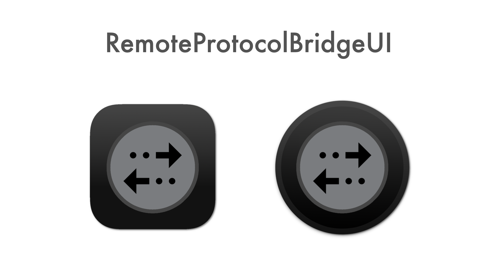
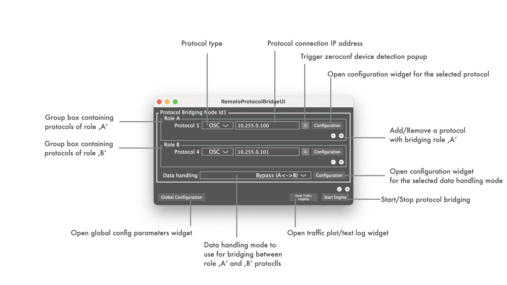

This repository contains the complementary part to the core code in https://github.com/ChristianAhrens/RemoteProtocolBridgeCore to build the RemoteProtocolBridge tool as was made publicly available by d&b audiotechnik in https://github.com/dbaudio-soundscape/db-Soundscape-control-with-DiGiCo-SD-Consoles - but in a modified and extended version.

